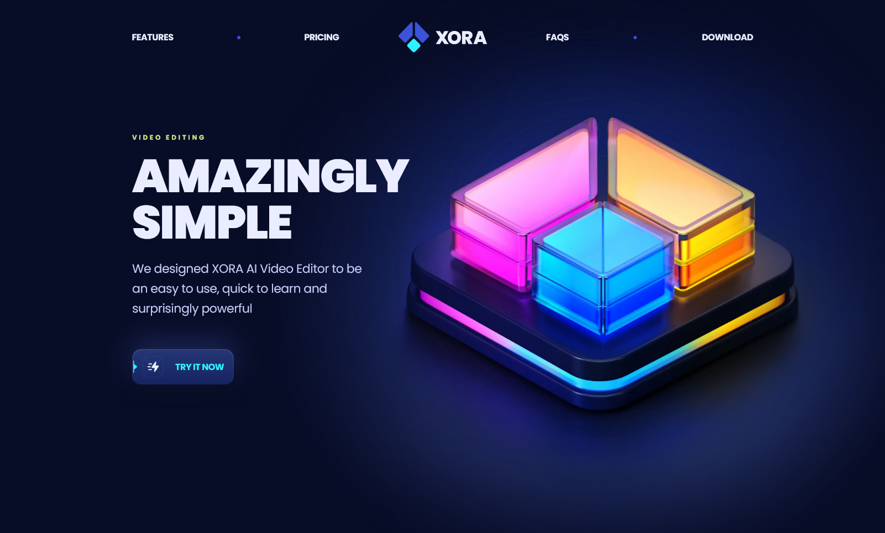

# Xora - Modern UI/UX SaaS Website

## 🤖 Introduction

**Xora** is a modern SaaS website developed using React.js and TailwindCSS, showcasing cutting-edge UI/UX design principles. With sleek design, seamless animations, and an optimized user experience, Xora sets a high standard for future web applications. This project serves as both a practical example and a source of inspiration for developers aiming to create modern, visually captivating websites. [Live Demo](https://xora-dutta.netlify.app)

## ⚙️ Tech Stack

- **React.js**: JavaScript library for building interactive user interfaces.
- **TailwindCSS**: Utility-first CSS framework for building responsive, customizable designs.
- **TypeScript**: Typed superset of JavaScript for type safety and code maintainability.
- **Framer Motion**: React animation library for creating complex animations and visual effects.
- **Vite**: Fast development build tool that enhances performance and optimizes the development process.

## 🔋 Features

1. **Stunning Sections**  
   The website includes beautifully designed sections such as:

   - Hero section
   - Features overview
   - Pricing plans (monthly/yearly)
   - FAQ (Frequently Asked Questions)
   - Testimonials
   - Software download section

2. **Smooth Animations**  
   Complex CSS is used to provide fluid, eye-catching animations, enhancing the user experience with smooth transitions between different sections of the website.

3. **Cool CSS Gradients**  
   Elegant gradient effects are applied using CSS with before and after pseudo-elements, creating visually stunning backgrounds and section dividers.

4. **Seamless Navigation**  
   Xora provides intuitive and smooth navigation across the site. The user experience is optimized for effortless scrolling and fast interactions, making the website feel highly responsive.

5. **Optimized Performance**  
   The website is built with performance in mind, ensuring fast loading times and a smooth experience across devices and browsers.

6. **Pixel Perfect Design**  
   The site is fully responsive and adapts flawlessly to all screen sizes, from mobile phones to large desktop displays, maintaining pixel-perfect precision in every detail.

7. **Advanced Animations with Framer Motion**  
   Added advanced animations, such as parallax effects, powered by **Framer Motion** to create dynamic scrolling effects and elevate the overall interactivity of the website.
